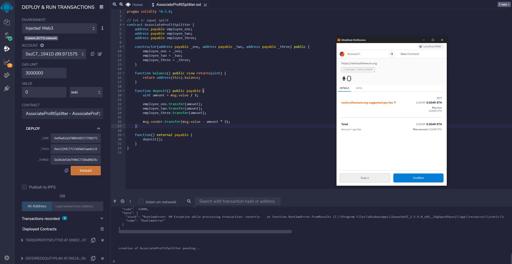
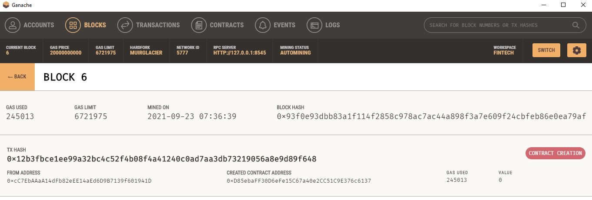
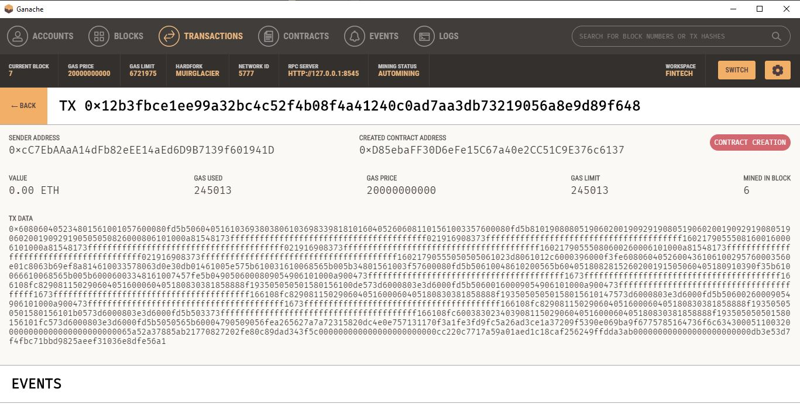
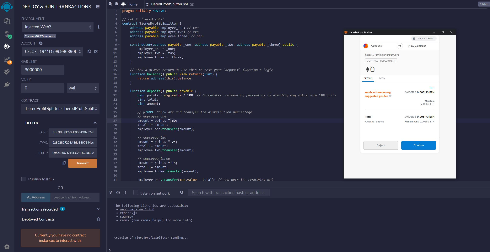
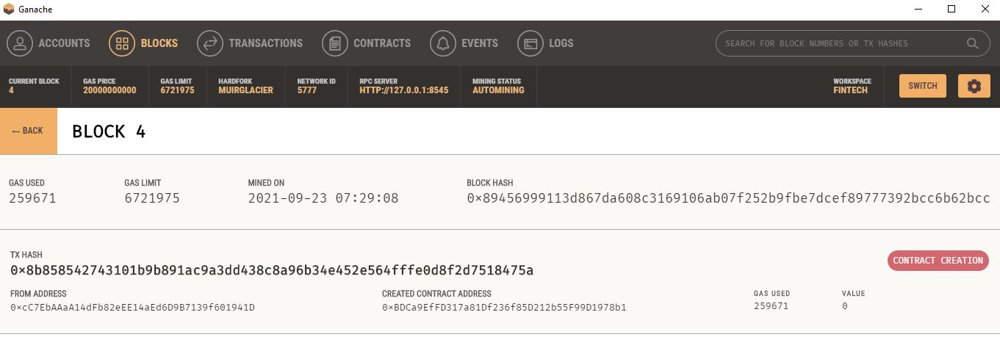
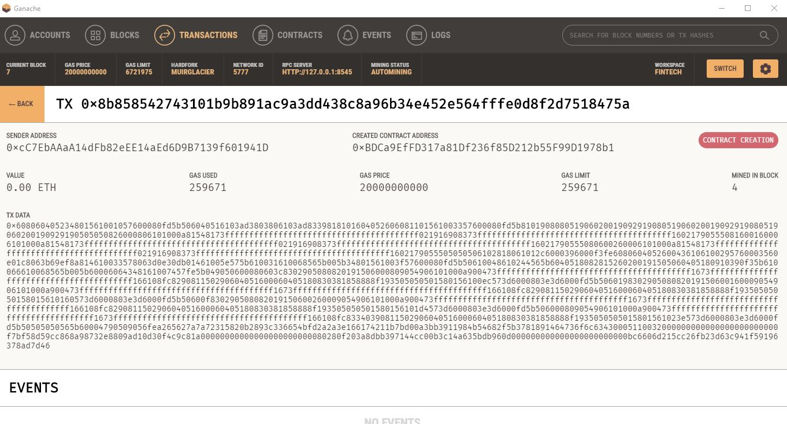
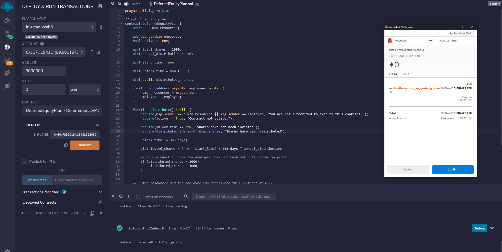
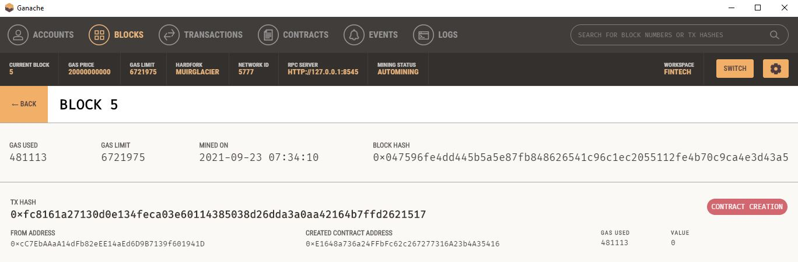
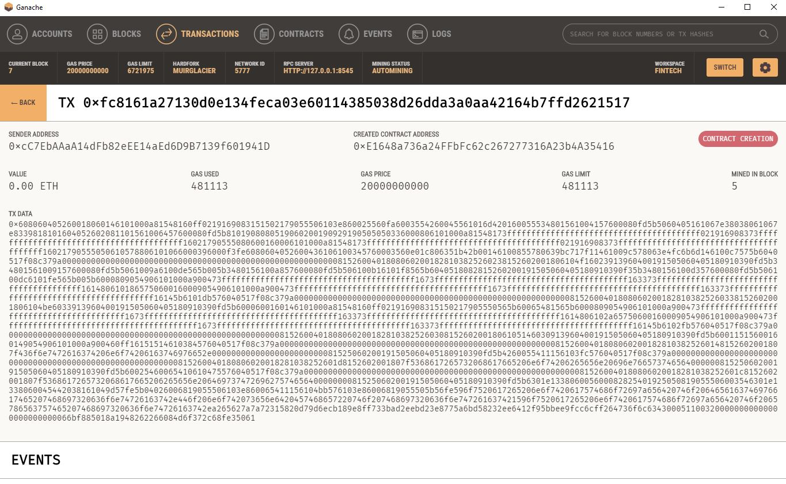

## Making smart contracts with SOLIDITY

   	

&nbsp;

&nbsp;

## AssociateProfitSplitter 

This contract will accept Ether into the contract, and divide it evenly among associate-level employees. This will allow the human resources department to pay employees quickly and efficiently. Below is a screenshot of the contract.

Below are screenshots of the tested transaction.

&nbsp;

&nbsp;

## TieredProfitSplitter
This contract will distribute different percentages of incoming ether to employees at different tiers/levels. For example, the CEO gets paid 60%, CTO 25%, and Bob gets 15%. Below is a screenshot of the contract.

Below are screenshots of the tested transaction.

&nbsp;

&nbsp;

## DeferredEquityPlan
This contract will automatically manage 1000 shares, with an annual distribution of 250 shares over four years for a single employee. Below is a screenshot of the contract.

Below are screenshots of the tested transaction.

